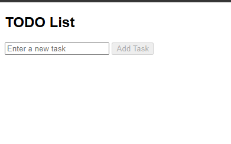

# IAP_Assignment
## How It Works

1. The submit button is **disabled** by default.
2. When the user types in the input field, the button is **enabled**.
3. When the form is submitted:
    - The task is **retrieved**.
    - A new `<li>` element is **created**.
    - The task is **added** to the list.
    - The input field is **cleared** & the button is **disabled** again.

